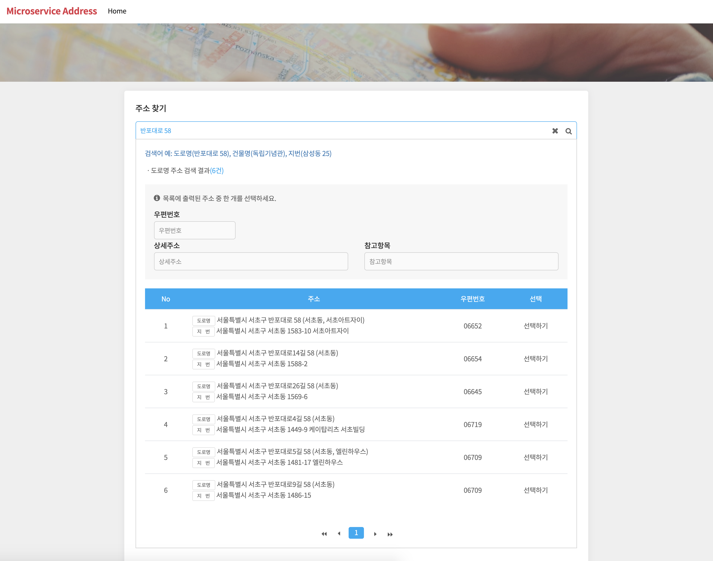
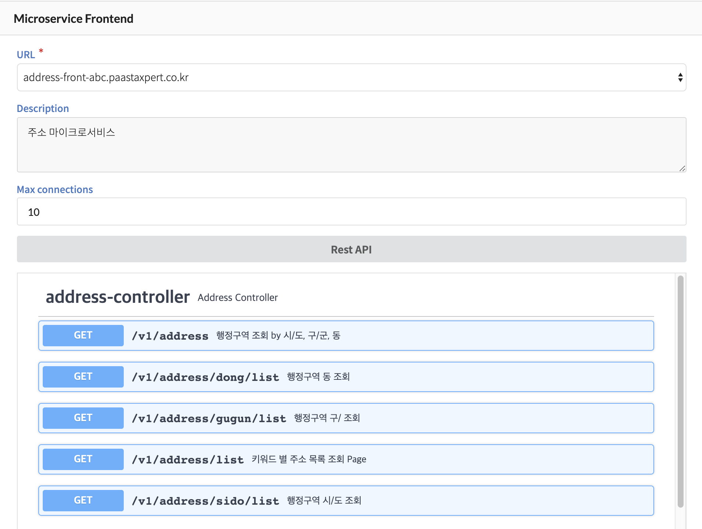
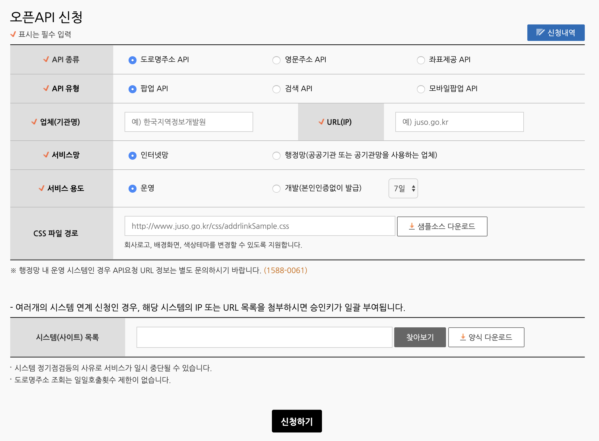
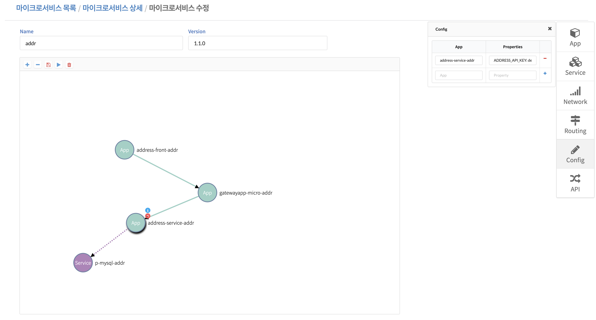
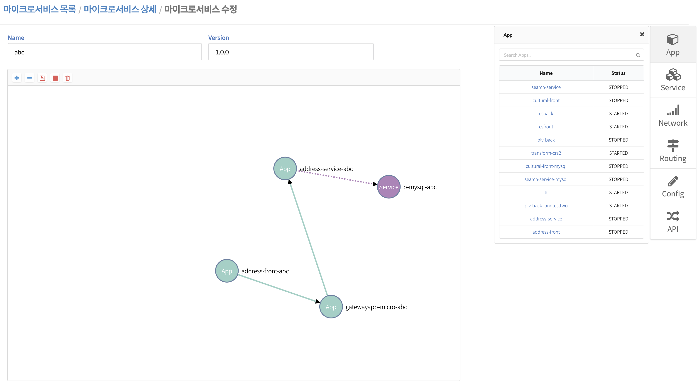

## Microservice Apartment
해당 샘플 앱은 MsXpert Studio를 활용을 목적으로 만들었으며 API Gateway, Eureka, Config Server 등을 직접 설정하지 않아도 Studio를 통해 네이티브 애플리케이션을 만들 수 있습니다. 또한, CF CLI를 통해  마이크로서비스 주소 애플리케이션을 직접 배포할 수 있습니다.


## Table of Contents
1. [서비스 소개](#Introduction)
2. [서비스 설계](#Architecture) 
3. [프론트엔드 API 문서 제공](#프론트엔드-api-문서-제공)
3. [배포 전 준비사항](#Preparations)
4. [앱 배포](#Application-Deploy)
5. [MsXpert Nipa 활용](#MsXpert-Studio-접속)


## Introduction
주소 마이크로서비스는 Mysql Service를 주소 backend App에 바인딩하여 행정구역 데이터를 저장 및 반환하고 있으며,  [도로명 주소 Open API](#http://www.juso.go.kr/addrlink/devAddrLinkRequestGuide.do?menu=roadApi)를 통해  데이터를 반환하고 있습니다. 
해당 서비스를 이용하기위해서는 도로명 주소 API 홈페이지에서 [검색 API 신청하기](#https://www.juso.go.kr/addrlink/devAddrLinkRequestWrite.do?returnFn=write&cntcMenu=URL) 서비스를 이용해야 합니다.  



## Architecture
해당 마이크로서비스는 Frontend, Gateway, Backend, Config Server, Registry 등 최소 5개의 앱으로 구성되어 있으며, 공동주택 가격정보 조회, 주소 조회 등의 마이크로서비스 Rest API를 요청하고 있습니다.  마이크로서비스 Studio를 사용한 앱 간의 관계는 다음과 같습니다.


## 프론트엔드 API 문서 제공
이 서비스는 MsXpert Studio를 이용하여 배포된 마이크로서비스의 Frontend 애플리케이션 API 문서를 조회할 수 있습니다.



- /v1/address?sido=&gugun=&dong=
- /v1/address/list?keyword=&page=&pageSize=
- /v1/address/sido/list
- /v1/address/gugun/list?sido=
- /v1/address/dong/list?sido=&gugun=


## Preparations

1. **[도로명 주소에서 제공하는 API 홈페이지](#https://www.juso.go.kr/addrlink/devAddrLinkRequestWrite.do?returnFn=write&cntcMenu=URL) 에서 오픈 API를 신청합니다.**


2. **주소 Open API 인증키 정보 입력** <br/>
주소 Open API에서 받은 인증키를 환경정보에 설정합니다. 설정하는 방법은 **두가지**가 있습니다. 아래 두가지 방법 중 한가지를 선택하세요.</br>

  2.1. aptTrade-service 프로젝트에서 수정<br/>
  aptTrade-service/src/main/resources/application.properties 수정

   ````
   $vi aptTrade-service/src/main/resources/application.properties
   
   #주소 Open API 포털 인증
   address.api.uri: http://www.juso.go.kr/addrlink/addrLinkApi.do
   address.api.key: ##인증키 입력
   ````

  2.2. Microservice Studio에서 Config 설정
   Microservice Studio 수정 화면에서 오른쪽 Tab에서 Config 정보를 입력합니다.

   

  |           App          |        Properties         |
  | :---------------------:| :------------------------:|
  | address-service-addr   | ADDRESS_API_KEY: 키입력     |

      
  3. **CF 또는 [PaaS-TA](#http://paas-ta.kr) 설치**

  4. **[CF  CLI](#https://github.com/cloudfoundry/cli/releases) 설치** 
       

## MySQL Service && Application Deploy
주소 마이크로서비스를 이용하기 위해서는 CF에 mysql Service 인스턴스를 생성 후 생성한 주소  backend 앱을 바인딩해야 합니다.  주소 backend 앱은 연결된 서비스를 인지하고  바인딩시 생성된 mysql 접속정보를 읽어오기 때문에 따로 backend App의 properties에 MySQL DB정보를 입력해야하는 번거로움을 해소해줍니다. (단, mysql 서비스가 설치되어있어야 합니다. 관련 자료는 [PaaS-TA 서비스 가이드 참조 ](#https://guide.paas-ta.kr/guide-4.0-rotelle/service-guide/dbms/paas-ta-mysql) ) 

1. address-frontend, address-service 프로젝트를 각각 빌드합니다.

    ````
    $ cd address-frontend 
    $ mvn clean package 
    $ cd ../address-service
    $ mvn clean package
    ````


2.  CF CLI를 통해 조직 및 영역을 생성합니다. [PaaS-TA 포털을 활용중일 경우 포털을 통해 조직 및 영역을 생성할 수 있습니다.] 
    PaaS-TA 포털에 배포할 조직 및 영역과 MsXpert Studio에 배포할 조직 및 영역을 각각 생성합니다.

      ````
      $ cf create-org user1-paasta
      $ cf create-space -o user1-paasta -s trade-paasta-space
      $ cf create-org user1-msa
      $ cf create-space -o user1-msa -s trade-msa-space
      ````


3. MsXpert Studio에서 user1-msa	조직에 앱을 copy하여 배포하기위해 user1-paasta 조직에 위 샘플앱(frontend, backend) 을  CF CLI을 통해 push합니다.

    ````
    $ cd address-frontend
    $ cf push --no-start ##manifest가 존재하는지 확인 
    $ cd ../address-service
    $ cf push --no-start
    ````

4. Manifest.yml 작성법

   ````
   applications:
   
      - name: ##frontend-> address-frontend /backend -> address-service
        memory: 1G
        path: (jar파일이 있는 경로)/(jar파일).jar
        buildpack: java_buildpack
        env:
           msa: yes
           private: (paasta 계정 id)
   ````

5. MySQL Service Instance 생성
  
    ````
    # 사용할 서비스 인스턴스 생성
    $ cf marketplace
    $ cf create-service { SERVICE명 }  { PLAN 명 } (SERVICE-INSTANCE 명) ## 예) cf create-service  p-mysql   20mb   test-mysql 
    # 생성한 서비스 인스턴스 조회
    $ cf services
    # 생성한 서비스인스턴스와 해당서비스를 이용할 앱 바인딩
    $ cf bind-service {APP_NAME} {SERVICE-INSTANCE}##cf bind-service  ##예) cf bind-service address-service test-mysql
    ````

## MsXpert Studio 접속

Paas-TA 계정을 가지고 MsXpert Studio에 접속하여  아래 이미지와 같이 user1-paasta 조직에 배포한 frontend, backend 앱을 마우스로 드래그하여 마이크로서비스를 설계할 수 있습니다.

    
